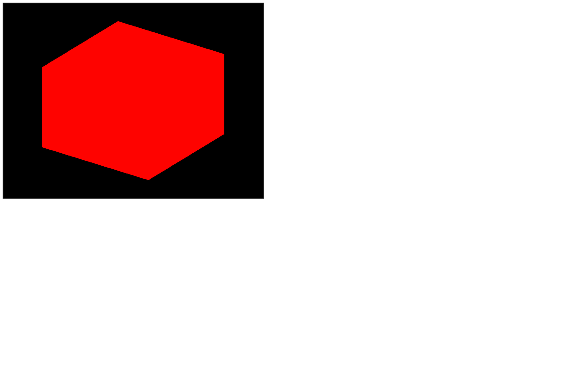
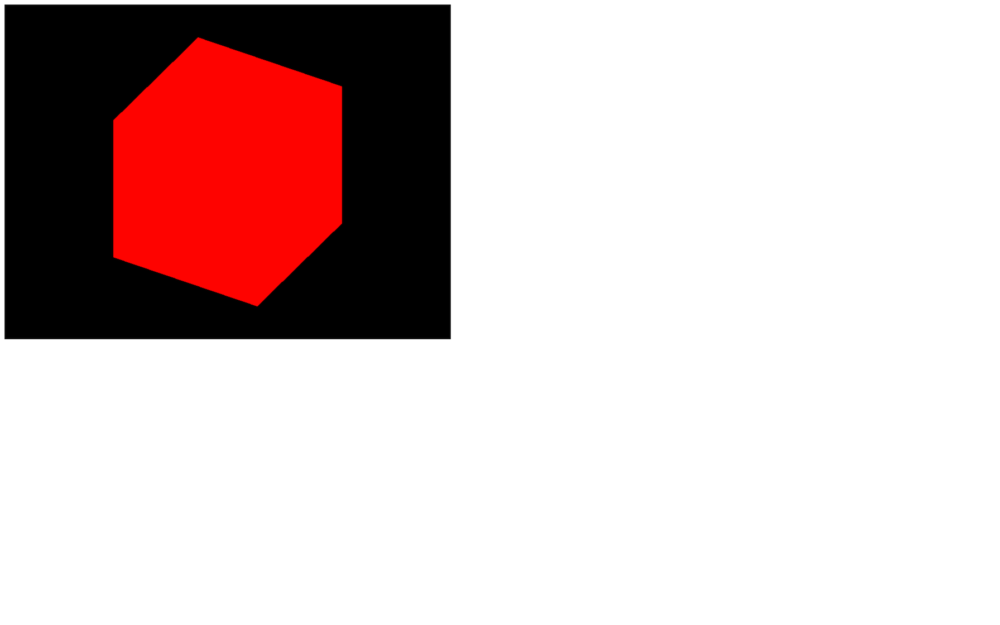
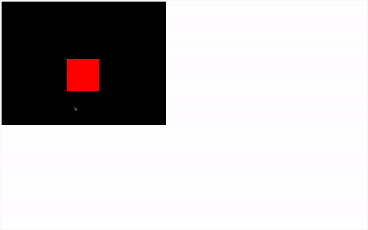
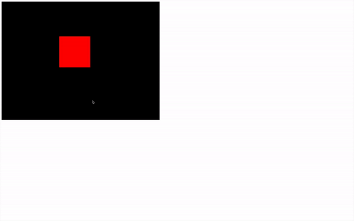
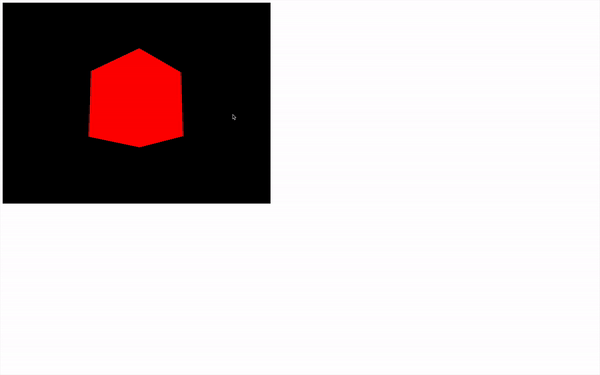
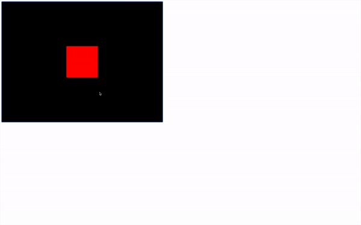

# Cameras

[](https://shields.io)

Learn in [https://threejs-journey.xyz/lessons/7](https://threejs-journey.xyz/lessons/7)

## Introduction

We already created a `PerspectiveCamera`, but there are other types of cameras, as you can see in the documentation.

#### Camera

The [Camera](https://threejs.org/docs/#api/en/cameras/Camera) class is what we call an abstract class. You're not supposed to use it directly, but you can inherit from it to have access to common properties and methods. Some of the following classes inherit from the [Camera](https://threejs.org/docs/#api/en/cameras/Camera) class.

#### ArrayCamera

The [ArrayCamera](https://threejs.org/docs/#api/en/cameras/ArrayCamera) is used to render your scene multiple times by using multiple cameras. Each camera will render a specific area of the canvas. You can imagine this looking like old school console multiplayer games where we had to share a split-screen.

#### StereoCamera

The [StereoCamera](https://threejs.org/docs/#api/en/cameras/StereoCamera) is used to render the scene through two cameras that mimic the eyes in order to create what we call a parallax effect that will lure your brain into thinking that there is depth. You must have the adequate equipment like a VR headset or red and blue glasses to see the result.

#### CubeCamera

The [CubeCamera](https://threejs.org/docs/#api/en/cameras/CubeCamera) is used to get a render facing each direction (forward, backward, leftward, rightward, upward, and downward) to create a render of the surrounding. You can use it to create an environment map for reflection or a shadow map. We'll talk about those later.

#### OrthographicCamera

The [OrthographicCamera](https://threejs.org/docs/#api/en/cameras/OrthographicCamera) is used to create orthographic renders of your scene without perspective. It's useful if you make an RTS game like Age of Empire. Elements will have the same size on the screen regardless of their distance from the camera.

#### PerspectiveCamera

The [PerspectiveCamera](https://threejs.org/docs/#api/en/cameras/PerspectiveCamera) is the one we already used and simulated a real-life camera with perspective.

We are going to focus on the [OrthographicCamera](https://threejs.org/docs/#api/en/cameras/OrthographicCamera) and the [PerspectiveCamera](https://threejs.org/docs/#api/en/cameras/PerspectiveCamera).

## PerspectiveCamera

As we saw earlier, the [PerspectiveCamera](https://threejs.org/docs/#api/en/cameras/PerspectiveCamera) class needs some parameters to be instantiated, but we didn't use all the possible parameters. Add the third and fourth parameters:

```js
const camera = new THREE.PerspectiveCamera(75, sizes.width / sizes.height, 1, 1000)
```


You should get the same result but let's talk about those parameters in detail.

#### Field of view

The first parameter called **field of view** corresponds to your camera view's vertical amplitude angle in degrees. If you use a small angle, you'll end up with a long scope effect, and if you use a wide-angle, you'll end up with a fish eye effect because, in the end, what the camera sees will be stretched or squeezed to fit the canvas.


_https://threejs-journey.xyz/assets/lessons/07/video-1.mp4_

As for choosing the right field of view, you'll have to try things out. I usually use a field of view between `45` and `75`.

#### Aspect ratio

The second parameter is called **aspect ratio** and corresponds to the width divided by the height. While you might think that it's obviously the canvas width by the camera height and Three.js should calculate it by itself, it's not always the case if you start using Three.js in very specific ways. But in our case, you can simply use the canvas width and the canvas height.

I recommend saving those values in an object because we are going to need them multiple times:

```js
const sizes = {
    width: 800,
    height: 600
}
```

#### Near and far

The third and fourth parameters called **near** and **far**, correspond to how close and how far the camera can see. Any object or part of the object closer to the camera than the `near` value or further to the camera than the `far` value will not show up on the render.

You can see that like in those old racing games where you could see the trees pop up in the distance.

While you might be tempted to use very small and very large values like `0.0001` and `9999999` you might end up with a bug called z-fighting where two faces seem to fight for which one will be rendered above the other.

[https://twitter.com/FreyaHolmer/status/799602767081848832](https://twitter.com/FreyaHolmer/status/799602767081848832)

[https://twitter.com/Snapman_I_Am/status/800567120765616128](https://twitter.com/Snapman_I_Am/status/800567120765616128)

Try to use reasonable values and increase those only if you need it. In our case, we can use `0.1` and `100`.

## OrthographicCamera

While we will not use this type of camera for the rest of the course, it can be useful for specific projects.

The [OrthographicCamera](https://threejs.org/docs/#api/en/cameras/OrthographicCamera) differs from the [PerspectiveCamera](https://threejs.org/docs/#api/en/cameras/PerspectiveCamera) by its lack of perspective, meaning that the objects will have the same size regardless of their distance from the camera.

The parameters you have to provide are very different from the [PerspectiveCamera](https://threejs.org/docs/#api/en/cameras/PerspectiveCamera).

Instead of a field of view, you must provide how far the camera can see in each direction (`left`, `right`, `top` and `bottom`). Then you can provide the `near` and `far` values just like we did for the [PerspectiveCamera](https://threejs.org/docs/#api/en/cameras/PerspectiveCamera).

Comment the [PerspectiveCamera](https://threejs.org/docs/#api/en/cameras/PerspectiveCamera) and add [OrthographicCamera](https://threejs.org/docs/#api/en/cameras/OrthographicCamera) . Let the `position` update and `lookAt(...)` call:

```js
const camera = new THREE.OrthographicCamera(- 1, 1, 1, - 1, 0.1, 100)
```



As you can see, there is no perspective, and the sides of our cube seem parallel. The problem is that our cube doesn't look cubic.

That is due to the values we provided for the `left`, `right`, `top`, and `bottom` which are `1` or `- 1`, meaning that we render a square area, but that square area will be stretched to fit our rectangle canvas and our canvas isn't a square.

We need to use the canvas ratio (width by height). Let's create a variable named `aspectRatio` (just like the PerspectiveCamera) and store that ratio in it:

```js
const aspectRatio = sizes.width / sizes.height
const camera = new THREE.OrthographicCamera(- 1 * aspectRatio, 1 * aspectRatio, 1, - 1, 0.1, 100)
```



This results in a render area width larger than the render area height because our canvas width is larger than its height.

We now have a cube that looks like a cube.

## Custom controls

Let's get back to our [PerspectiveCamera](https://threejs.org/docs/#api/en/cameras/PerspectiveCamera). Comment the [OrthographicCamera](https://threejs.org/docs/#api/en/cameras/OrthographicCamera), uncomment the [PerspectiveCamera](https://threejs.org/docs/#api/en/cameras/PerspectiveCamera), move the `camera` so it faces the cube, and remove the mesh rotation in the `tick` function:

```js
// Camera
const camera = new THREE.PerspectiveCamera(75, sizes.width / sizes.height, 1, 1000)

// const aspectRatio = sizes.width / sizes.height
// const camera = new THREE.OrthographicCamera(- 1 * aspectRatio, 1 * aspectRatio, 1, - 1, 0.1, 100)

// camera.position.x = 2
// camera.position.y = 2
camera.position.z = 3
camera.lookAt(mesh.position)
scene.add(camera)
```

What we want to do now is control the camera with our mouse. First of all, we want to know the mouse coordinates. We can do that using native JavaScript by listening to the `mousemove` event with `addEventListener`.

The coordinates will be located in the argument of the callback function as `event.clientX` and `event.clientY`:

```js
// Cursor
window.addEventListener('mousemove', (event) =>
{
    console.log(event.clientX, event.clientY)
})
```

We could use those values, but I recommend adjusting them. By adjusting, I mean to have a `1` amplitude and that the value can be both negative and positive.

If we only focus on the `x` value, that would mean that:

- if your cursor is on the far left of the canvas, you should get `- 0.5`
- if your cursor is at the center of the canvas, you should get `0`
- if your cursor is at the far right of the canvas, you should get `0.5`

While this is not mandatory, it helps to have clean values like that.

Just like the `size` variable, we will create a `cursor` variable with default `x` and `y` properties and then update those properties in the `mousemove` callback:

```js
// Cursor
const cursor = {
    x: 0,
    y: 0
}

window.addEventListener('mousemove', (event) =>
{
    cursor.x = event.clientX / sizes.width - 0.5
    cursor.y = event.clientY / sizes.height - 0.5

    console.log(cursor.x, cursor.y)
})
```

Dividing `event.clientX` by `sizes.width` will give us a value between `0` and `1` (if we keep the cursor above the canvas) while subtracting `0.5` will give you a value between `- 0.5` and `0.5`.

You now have the mouse position stored in the `cursor` object variable, and you can update the position of the camera in the `tick` function:

```js
const tick = () =>
{
    // ...

    // Update camera
    camera.position.x = cursor.x
    camera.position.y = cursor.y

    // ...
} 
```



_https://threejs-journey.xyz/assets/lessons/07/step-04.mp4_

As you can see, it's working but the axes movements seem kind of wrong. This is due to the `position.y` axis being positive when going upward in Three.js but the `clientY` axis being positive when going downward in the webpage.

You can simply invert the `cursor.y` while updating it by adding a `-` in front of the whole formula (don't forget the parentheses):

```js
window.addEventListener('mousemove', (event) =>
{
    cursor.x = event.clientX / sizes.width - 0.5
    cursor.y = - (event.clientY / sizes.height - 0.5)
})
```



_https://threejs-journey.xyz/assets/lessons/07/step-05.mp4_

Finally, you can increase the amplitude by multiplying the `cursor.x` and `cursor.y` and ask the camera to look at the mesh using the `lookAt(...)` method:

```js
const tick = () =>
{
    // ...

    // Update camera
    camera.position.x = cursor.x * 5
    camera.position.y = cursor.y * 5
    camera.lookAt(mesh.position)

    // ...
}
```


_https://threejs-journey.xyz/assets/lessons/07/step-06.mp4_

We can go even further by doing a full rotation of the camera around the mesh by using `Math.sin(...)` and `Math.cos(...)`.

`sin` and `cos`, when combined and used with the same angle, enable us to place things on a circle. To do a full rotation, that angle must have an amplitude of 2 times π (called "pi"). Just so you know, a full rotation is called a "tau" but we don't have access to this value in JavaScript and we have to use π instead.

You can access an approximation of π in native JavaScript using `Math.PI`.

To increase the radius of that circle, you can simply multiply the result of `Math.sin(...)` and `Math.cos(...)`:

```js
const tick = () =>
{
    // ...

    // Update camera
    camera.position.x = Math.sin(cursor.x * Math.PI * 2) * 2
    camera.position.z = Math.cos(cursor.x * Math.PI * 2) * 2
    camera.position.y = cursor.y * 3
    camera.lookAt(mesh.position)

    // ...
}

tick()
```



_https://threejs-journey.xyz/assets/lessons/07/step-07.mp4_

While this is a good start to control the camera, Three.js has integrated multiple classes called controls to help you do the same and much more.

## Built-in controls

If you type "controls" in the [Three.js documentation](https://threejs.org/docs/index.html#api/en/math/Euler), you'll see that there are a lot of pre-made controls. We will only use one of them for the rest of the course, but it can be interesting to know their role.

#### DeviceOrientationControls

[DeviceOrientationControls](https://threejs.org/docs/#examples/en/controls/DeviceOrientationControls) will automatically retrieve the device orientation if your device, OS, and browser allow it and rotate the camera accordingly. You can use it to create immersive universes or VR experiences if you have the right equipment.

#### FlyControls

[FlyControls](https://threejs.org/docs/#examples/en/controls/FlyControls) enable moving the camera like if you were on a spaceship. You can rotate on all 3 axes, go forward and go backward.

#### FirstPersonControls

[FirstPersonControls](https://threejs.org/docs/#examples/en/controls/FirstPersonControls) is just like [FlyControls](https://threejs.org/docs/#examples/en/controls/FlyControls), but with a fixed up axis. You can see that like a flying bird view where the bird cannot do a barrel roll.
While the FirstPersonControls contains "FirstPerson," it doesn't work like in FPS games.

#### PointerLockControls

[PointerLockControls](https://threejs.org/docs/#examples/en/controls/PointerLockControls) uses the [pointer lock JavaScript API](https://developer.mozilla.org/docs/Web/API/Pointer_Lock_API). This API hides the cursor, keeps it centered, and keeps sending the movements in the `mousemove` event callback. With this API, you can create FPS games right inside the browser.
While this class sounds very promising if you want to create that kind of interaction, it'll only handle the camera rotation when the pointer is locked. You'll have to handle the camera position and game physics by yourself.

#### OrbitControls

[OrbitControls](https://threejs.org/docs/#examples/en/controls/OrbitControls) is very similar to the controls we made in the previous lesson. You can rotate around a point with the left mouse, translate laterally using the right mouse, and zoom in or out using the wheel.

#### TrackballControls

[TrackballControls](https://threejs.org/docs/#examples/en/controls/TrackballControls) is just like [OrbitControls](https://threejs.org/docs/#examples/en/controls/OrbitControls) but there are no limits in terms of vertical angle. You can keep rotating and do spins with the camera even if the scene gets upside down.

#### TransformControls

[TransformControls](https://threejs.org/docs/#examples/en/controls/TransformControls) has nothing to do with the camera. You can use it to add a gizmo to an object to move that object.

#### DragControls

Just like the [TransformControls](https://threejs.org/docs/#examples/en/controls/TransformControls), [DragControls](https://threejs.org/docs/#examples/en/controls/DragControls) has nothing to do with the camera. You can use it to move objects on a plane facing the camera by drag and dropping them.

We will only use the [OrbitControls](https://threejs.org/docs/#examples/en/controls/OrbitControls) but feel free to test the other classes.

## OrbitControls

Let's comment the part where we update the `camera` in the `tick` function.

### Instanciating

First, we need to instantiate a variable using the [OrbitControls](https://threejs.org/docs/#examples/en/controls/OrbitControls) class. While you might think you can use `THREE.OrbitControls` here, you are unfortunately mistaken.

The OrbitControls class is part of those classes that are not available by default in the `THREE` variable. That decision helps to reduce the weight of the library. And this is where our Webpack template comes in.

The `OrbitControls` class may not be available in the `THREE` variable; it is still located in the dependencies folder. To import it, you must provide the path from inside the `/node_modules/` folder, which is `/three/examples/jsm/controls/OrbitControls.js`:

```js
import { OrbitControls } from 'three/examples/jsm/controls/OrbitControls.js'
```

You can now instantiate a variable using the class `OrbitControls` (without the `THREE.`) and make sure to do that after creating the camera.

For it to work, you must provide the camera and the element in the page that will handle the mouse events as parameters:

```js
// Controls
const controls = new OrbitControls(camera, canvas)
```



_https://threejs-journey.xyz/assets/lessons/07/step-08.mp4_

You can now drag and drop using both the left mouse or the right mouse to move the camera, and you can scroll up or down to zoom in or out.

It's much easier than our custom code, and it comes with more controls. But let's go a little further.

### Target

By default, the camera is looking at the center of the scene. We can change that with the `target` property.

This property is a [Vector3](https://threejs.org/docs/#api/en/math/Vector3), meaning that we can change its `x`, `y` and `z` properties.

If we want the [OrbitControls](https://threejs.org/docs/#examples/en/controls/OrbitControls) to look above the cube by default, we just have to increase the `y` property:

```js
controls.target.y = 2
```

This is not very useful in our case so let's comment this part.

### Damping

If you read the documentation of [OrbitControls](https://threejs.org/docs/#examples/en/controls/OrbitControls) there are mentions of `damping`. The damping will smooth the animation by adding some kind of acceleration and friction formulas.

To enable damping, switch the `enableDamping` property of `controls` to `true`.

In order to work properly, the controls also needs to be updated on each frame by calling `controls.update()`. You can do that on the `tick` function:

```js
// Controls
const controls = new OrbitControls(camera, canvas)
controls.enableDamping = true

// ...

const tick = () =>
{
    // ...

    // Update controls
    controls.update()

    // ...
}
```


_https://threejs-journey.xyz/assets/lessons/07/step-09.mp4_

You'll see that the controls are now a lot smoother.

You can use many other methods and properties to customize your controls such as the rotation speed, zoom speed, zoom limit, angle limit, damping strength, and key bindings (because yes, you can also use your keyboard).

## When to use built-in controls

While those controls are handy, they have limitations. If you rely too much on them, you might end up having to change how the class is working in an unexpected way.

First, make sure to list all the features you need from those controls, then check if the class you're about to use can handle all of those features.

If not, you'll have to do it on your own.
