# Haunted House

[](https://shields.io)

Learn in [https://threejs-journey.xyz/lessons/16](https://threejs-journey.xyz/lessons/16)

## Introduction

Let's use what we've learned to create a haunted house. We will only use Three.js primitives as geometries, the textures in the `/static/textures/` folder, and one or two new features.

We will create an elementary house composed of walls, a roof, a door, and some bushes. We will also produce graves in the garden. Instead of visible ghosts made of sheets, we will simply use multicolor lights floating around and passing through the walls and the floor.

## Tips for measurements

One beginner mistake we always make when creating something using primitives is using random measures. One unit in Three.js can mean anything you want.

Suppose you are creating a considerable landscape to fly above. In that case, you might think of one unit as one kilometer. If you are building a house, you might think of one unit as one meter, and if you are making a marble game, you might think of one unit as one centimeter.

Having a specific unit ratio will help you create geometries. Let's say you want to make the door. You know that a door is slightly taller than you, so it should reach around 2 meters.

For those using imperials units, you'll have to do the conversion.

## Setup

The starter is only composed of a floor, a sphere, some lights (way too intense for a haunted house), and shadows aren't even working.

We will have to create the house all by ourselves, tweak the current lights for a better ambiance, add the shadows, and the rest.

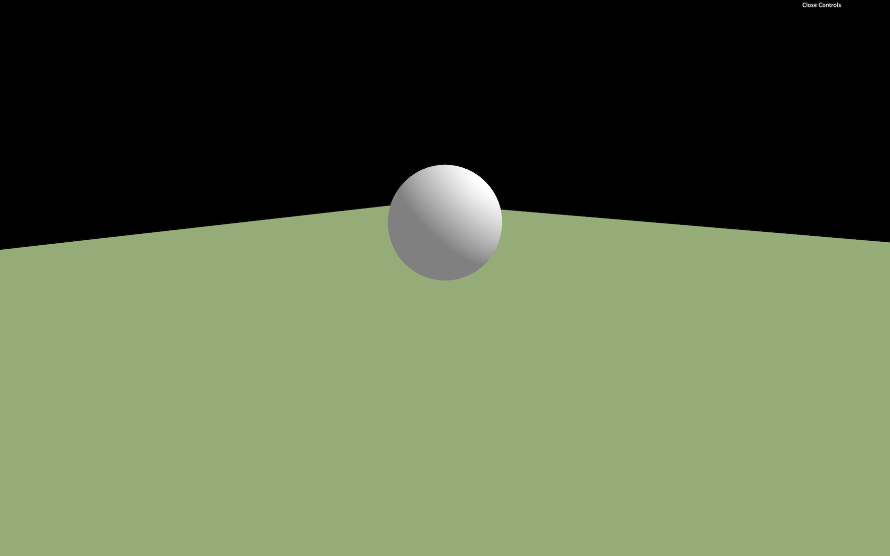

## The house

First, let's remove the sphere and create a tiny house. We can leave the floor.

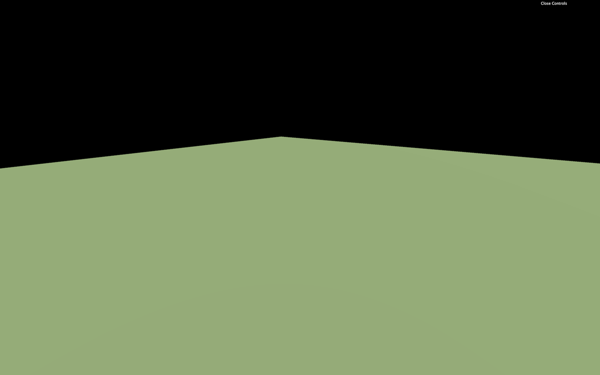

Instead of putting every object composing that house in the scene, we will first create a container just in case we want to move or scale the whole thing:

```js
// House container
const house = new THREE.Group()
scene.add(house)
```

Then we can create the walls with a simple cube and add it to the `house`. Don't forget to move the walls up on the `y` axis; otherwise it will be half inside the floor:

```js
const walls = new THREE.Mesh(
    new THREE.BoxGeometry(4, 2.5, 4),
    new THREE.MeshStandardMaterial({ color: '#ac8e82' })
)
walls.position.y = 1.25
house.add(walls)
```

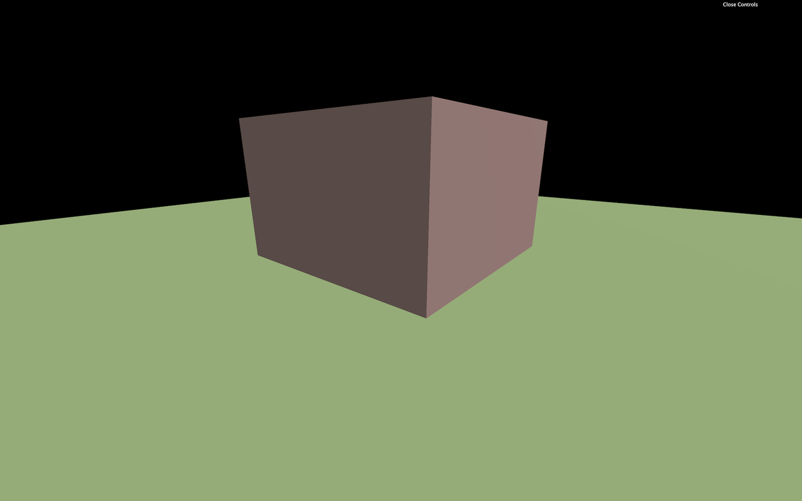

We chose `2.5` for the height because it would seem like a normal height for the ceiling. We also chose `'#ac8e82'` for the color, but it's temporary, and we will replace those colors with textures later.

For the roof, we want to make a pyramid shape. The problem is that Three.js doesn't have this kind of geometry. But if you start from a cone and reduce the number of sides to `4`, you'll get a pyramid. Sometimes you just have to deflect basic features usages:

```js
// Roof
const roof = new THREE.Mesh(
    new THREE.ConeGeometry(3.5, 1, 4),
    new THREE.MeshStandardMaterial({ color: '#b35f45' })
)
roof.rotation.y = Math.PI * 0.25
roof.position.y = 2.5 + 0.5
house.add(roof)
```


Finding the right position and the right rotation might be a little hard. Take your time, try to figure out the logic behind the values, and don't forget that `Math.PI` is your friend.

As you can see, we left `2.5 + 0.5`. We could have written `3` but it's sometime better to visualize the logic behind the value. `2.5`, because the roof walls are `2.5` units high and `0.5` because the cone is `1` unit high (and we need to move it up to half its height).

We will use a simple plane for the door as we are going to use the beautiful door texture we used in a previous lesson.

```js
// Door
const door = new THREE.Mesh(
    new THREE.PlaneGeometry(2, 2),
    new THREE.MeshStandardMaterial({ color: '#aa7b7b' })
)
door.position.y = 1
door.position.z = 2 + 0.01
house.add(door)
```


We don't know yet if the plane has the right size, but we can fix that later when we have the textures working.

As you can see, we move the door on the `z` axis to stick it to the wall but we also added `0.01` units. If you don't add this small value, you'll have a bug we already saw in a previous lesson called z-fighting. Z-fighting happens when you have two faces in the same position (or very close). The GPU doesn't know which one is closer than the other, and you get some strange visual pixel fighting.

Let's add some bushes. Instead of creating one geometry for each bush, we will create only one, and all meshes will share it. The result will be visually the same, but we'll get a performance improvement. We can do the same with the material.

```js
// Bushes
const bushGeometry = new THREE.SphereGeometry(1, 16, 16)
const bushMaterial = new THREE.MeshStandardMaterial({ color: '#89c854' })

const bush1 = new THREE.Mesh(bushGeometry, bushMaterial)
bush1.scale.set(0.5, 0.5, 0.5)
bush1.position.set(0.8, 0.2, 2.2)

const bush2 = new THREE.Mesh(bushGeometry, bushMaterial)
bush2.scale.set(0.25, 0.25, 0.25)
bush2.position.set(1.4, 0.1, 2.1)

const bush3 = new THREE.Mesh(bushGeometry, bushMaterial)
bush3.scale.set(0.4, 0.4, 0.4)
bush3.position.set(- 0.8, 0.1, 2.2)

const bush4 = new THREE.Mesh(bushGeometry, bushMaterial)
bush4.scale.set(0.15, 0.15, 0.15)
bush4.position.set(- 1, 0.05, 2.6)

house.add(bush1, bush2, bush3, bush4)
```

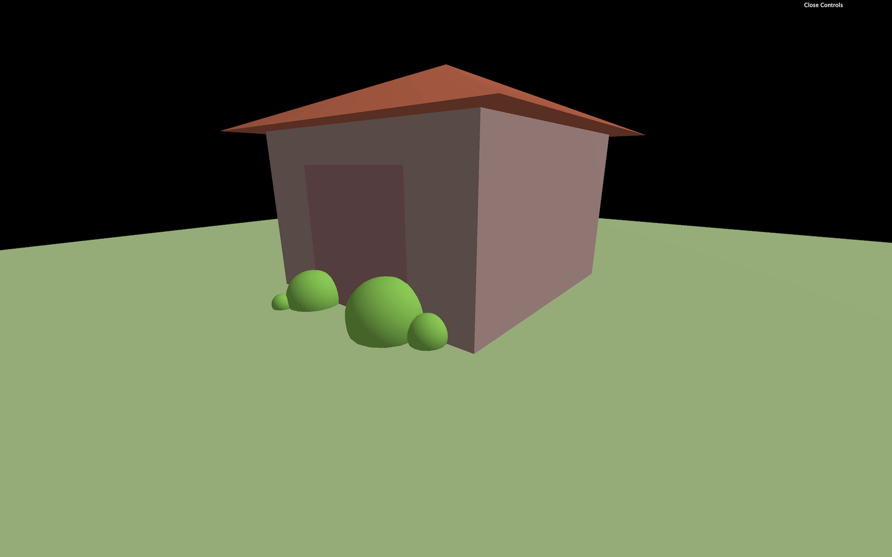

It does take too long to place and scale all these objects directly in the code. In a later lesson, we will learn how to use a 3D software to create all of this.

We won't add too many details to the house because we must move forward, but feel free to pause and add anything you want like low walls, an alley, windows, a chimney, rocks, etc.

## The graves

Instead of placing each grave manually, we are going to create and place them procedurally.

The idea is to place the graves randomly on a circle around the house.

First, let's create a container just in case:

```js
// Graves
const graves = new THREE.Group()
scene.add(graves)
```

Like in the **3D Text** lesson where we created multiple donuts with one geometry and one material, we are going to create one [BoxGeometry](https://threejs.org/docs/index.html#api/en/geometries/BoxGeometry) and one [MeshStandardMaterial](https://threejs.org/docs/index.html#api/en/materials/MeshStandardMaterial) that will be shared amongst every graves:

```js
const graveGeometry = new THREE.BoxGeometry(0.6, 0.8, 0.2)
const graveMaterial = new THREE.MeshStandardMaterial({ color: '#b2b6b1' })
```

Finally, let's loop and do some mathematics to position a bunch of graves around the house.

We are going to create a random angle on a circle. Remember that a full revolution is 2 times π. Then we are going to use that angle on both a `sin(...)` and a `cos(...)`. This is how you position things on a circle when you have the angle. And finally we also multiply those `sin(...)` and `cos(...)` results by a random value because we don't want the graves to be positioned on a perfect circle.

```js
for(let i = 0; i < 50; i++)
{
    const angle = Math.random() * Math.PI * 2 // Random angle
    const radius = 3 + Math.random() * 6      // Random radius
    const x = Math.cos(angle) * radius        // Get the x position using cosinus
    const z = Math.sin(angle) * radius        // Get the z position using sinus

    // Create the mesh
    const grave = new THREE.Mesh(graveGeometry, graveMaterial)

    // Position
    grave.position.set(x, 0.3, z)                              

    // Rotation
    grave.rotation.z = (Math.random() - 0.5) * 0.4
    grave.rotation.y = (Math.random() - 0.5) * 0.4

    // Add to the graves container
    graves.add(grave)
}
```

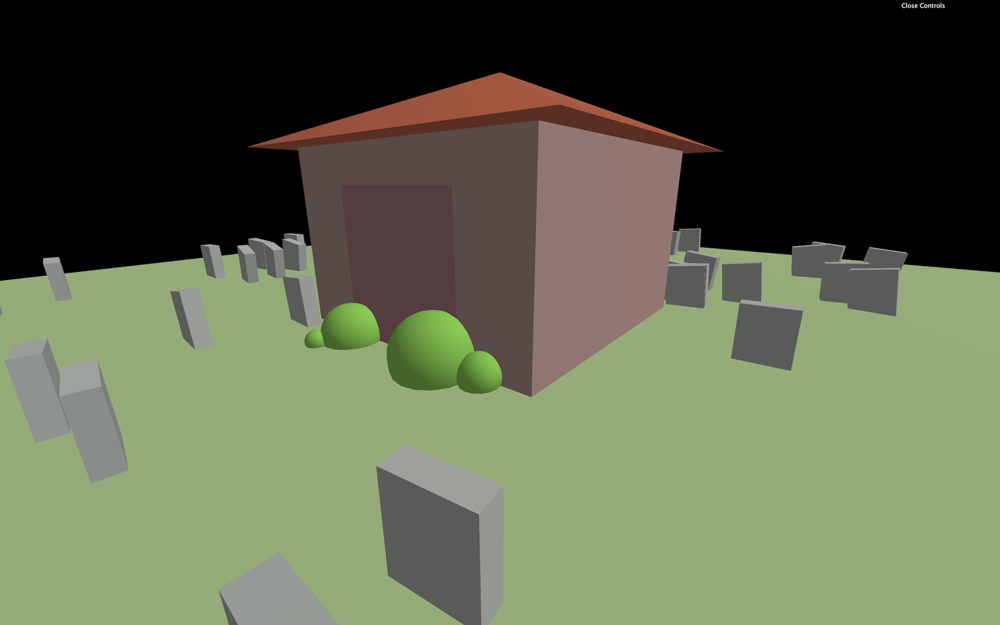

## Lights

We have a pretty cool scene, but it's not that scary yet.

First, let's dim the ambient and moon lights and give those a more blue-ish color:

```js
const ambientLight = new THREE.AmbientLight('#b9d5ff', 0.12)

// ...

const moonLight = new THREE.DirectionalLight('#b9d5ff', 0.12)
```


We can't see much right now. Let's also add a warm [PointLight](https://threejs.org/docs/index.html#api/en/lights/PointLight) above the door. Instead of adding this light to the scene, we can add it to the house:

```js
// Door light
const doorLight = new THREE.PointLight('#ff7d46', 1, 7)
doorLight.position.set(0, 2.2, 2.7)
house.add(doorLight)
```

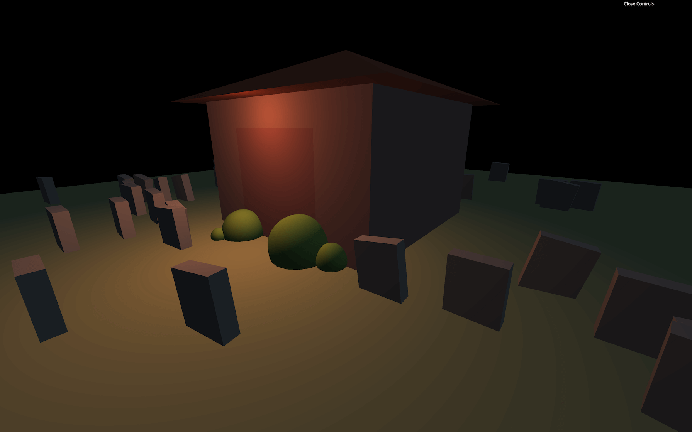

## Fog

In horror movies, they always use fog. The good news is that Three.js supports it already with the [Fog](https://threejs.org/docs/#api/en/scenes/Fog) class.

The first parameter is the `color`, the second parameter is the `near` (how far from the camera does the fog start), and the third parameter is the `far` (how far from the camera will the fog be fully opaque).

To activate the fog, add the `fog` property to the `scene`:

```js
/**
 * Fog
 */
const fog = new THREE.Fog('#262837', 1, 15)
scene.fog = fog
```

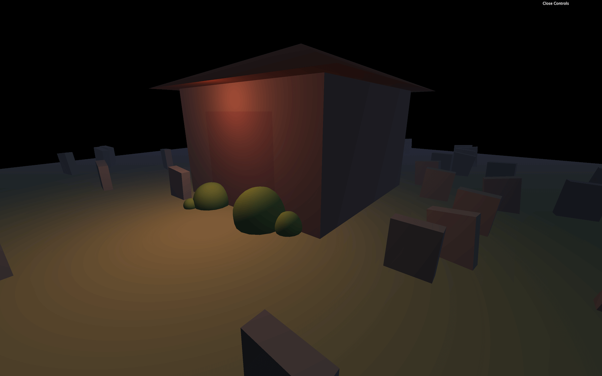

Not bad, but we can see a clean cut between the graves and the black background.

To fix that, we must change the clear color of the `renderer` and use the same color as the fog. Do that after instantiating the `renderer`:

```js
renderer.setClearColor('#262837')
```

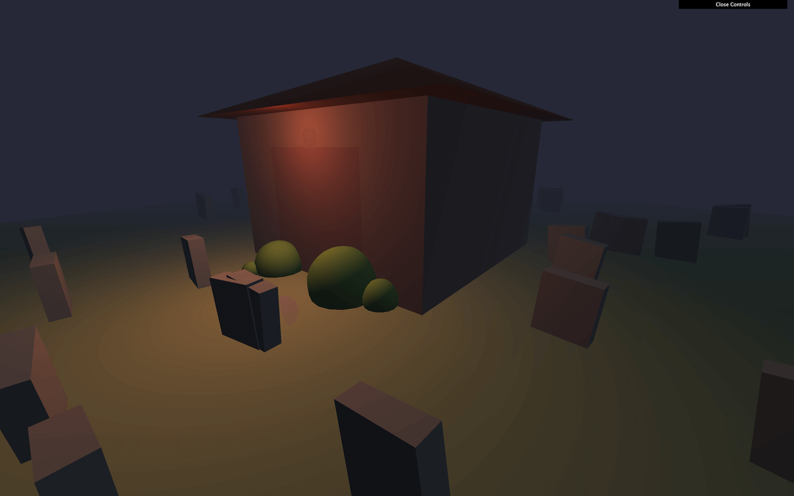

Here's a slightly scarier scene.

## Textures

For even more realism, we can add textures. The `textureLoader` is already in the code.

### The door

Let's start with something we already know and load all the door textures:

```js
const doorColorTexture = textureLoader.load('/textures/door/color.jpg')
const doorAlphaTexture = textureLoader.load('/textures/door/alpha.jpg')
const doorAmbientOcclusionTexture = textureLoader.load('/textures/door/ambientOcclusion.jpg')
const doorHeightTexture = textureLoader.load('/textures/door/height.jpg')
const doorNormalTexture = textureLoader.load('/textures/door/normal.jpg')
const doorMetalnessTexture = textureLoader.load('/textures/door/metalness.jpg')
const doorRoughnessTexture = textureLoader.load('/textures/door/roughness.jpg')
```

Then we can apply all those textures to the door material. Don't forget to add more subdivisions to the [PlaneGeometry](https://threejs.org/docs/index.html#api/en/geometries/PlaneGeometry), so the `displacementMap` has some vertices to move. Also, add the `uv2` attribute to the geometry for the `aoMap` as we did in the **Materials** lesson.

You can access the door's geometry by using `mesh.geometry`:

```js
const door = new THREE.Mesh(
    new THREE.PlaneGeometry(2, 2, 100, 100),
    new THREE.MeshStandardMaterial({
        map: doorColorTexture,
        transparent: true,
        alphaMap: doorAlphaTexture,
        aoMap: doorAmbientOcclusionTexture,
        displacementMap: doorHeightTexture,
        displacementScale: 0.1,
        normalMap: doorNormalTexture,
        metalnessMap: doorMetalnessTexture,
        roughnessMap: doorRoughnessTexture
    })
)
door.geometry.setAttribute('uv2', new THREE.Float32BufferAttribute(door.geometry.attributes.uv.array, 2))
```

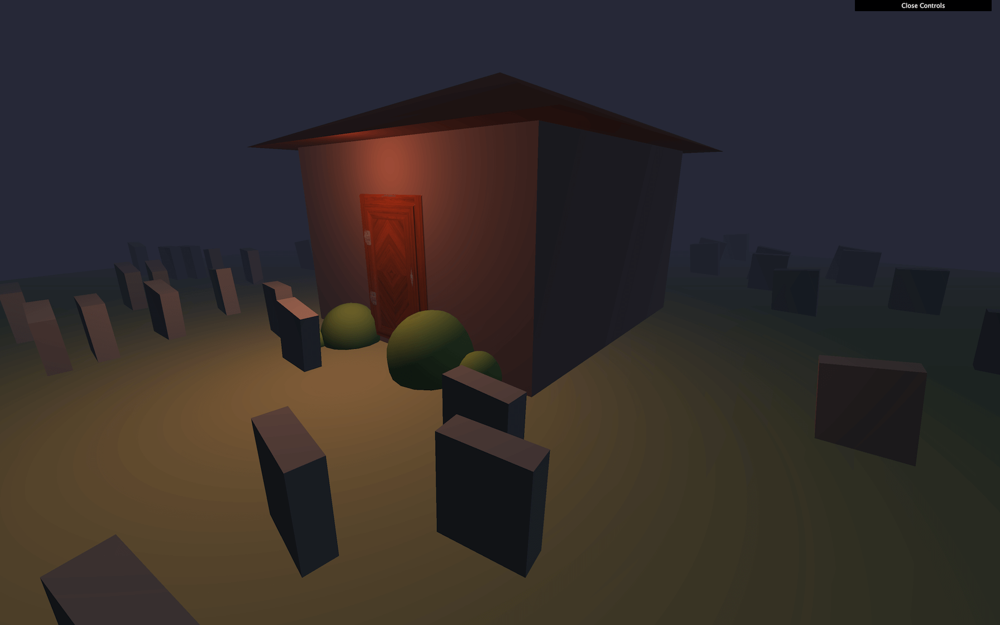

There you go! That's a more realistic door.

Now that we have the textures, you realize that the door is a little too small. You can simply increase the [PlaneGeometry](https://threejs.org/docs/index.html#api/en/geometries/PlaneGeometry) sizes:

```js
// ...
    new THREE.PlaneGeometry(2.2, 2.2, 100, 100),
// ...
```

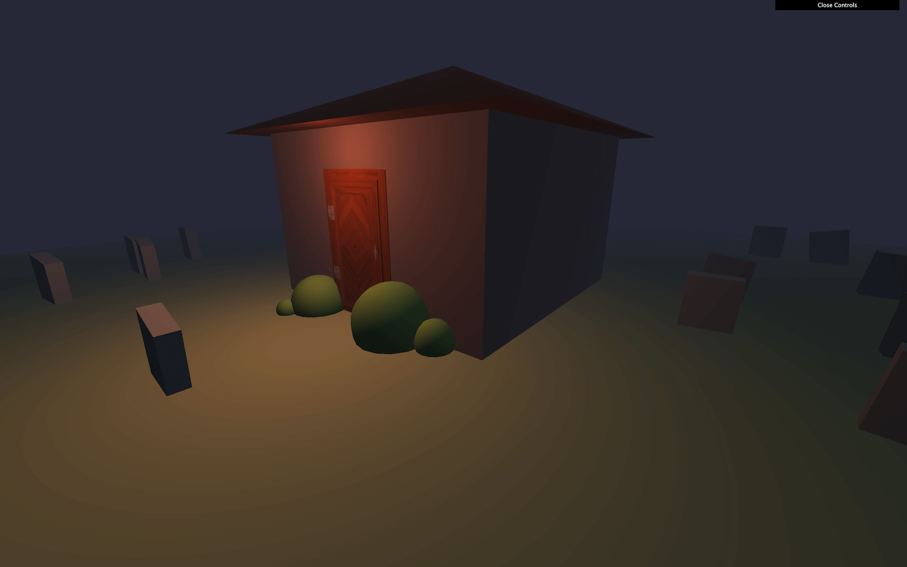

### The walls

Let's do the same for the walls using the textures on the `/static/textures/bricks/` folder. We don't have as many textures as for the door, but it's not a problem. We don't need an alpha texture, and the wall has no metal in it, so we don't need a metalness texture either.

Load the textures:

```js
const bricksColorTexture = textureLoader.load('/textures/bricks/color.jpg')
const bricksAmbientOcclusionTexture = textureLoader.load('/textures/bricks/ambientOcclusion.jpg')
const bricksNormalTexture = textureLoader.load('/textures/bricks/normal.jpg')
const bricksRoughnessTexture = textureLoader.load('/textures/bricks/roughness.jpg')
```

Then we can update our [MeshStandardMaterial](https://threejs.org/docs/index.html#api/en/materials/MeshStandardMaterial) for the wall. Don't forget to remove the `color` and add the `uv2` attribute for the ambient occlusion.

```js
const walls = new THREE.Mesh(
    new THREE.BoxGeometry(4, 2.5, 4),
    new THREE.MeshStandardMaterial({
        map: bricksColorTexture,
        aoMap: bricksAmbientOcclusionTexture,
        normalMap: bricksNormalTexture,
        roughnessMap: bricksRoughnessTexture
    })
)
walls.geometry.setAttribute('uv2', new THREE.Float32BufferAttribute(walls.geometry.attributes.uv.array, 2))
```

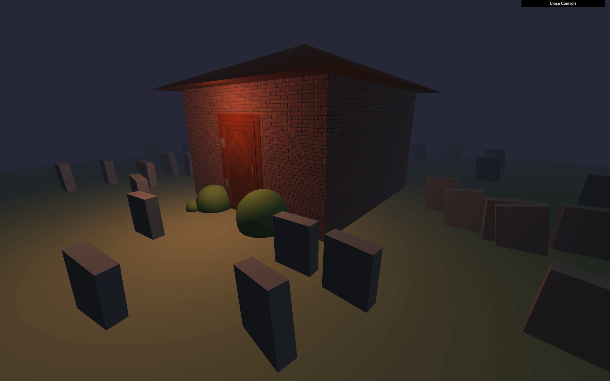

### The floor

Same deal as for the walls. The grass textures are located in the `/static/textures/grass/` folder.

Load the textures:

```js
const grassColorTexture = textureLoader.load('/textures/grass/color.jpg')
const grassAmbientOcclusionTexture = textureLoader.load('/textures/grass/ambientOcclusion.jpg')
const grassNormalTexture = textureLoader.load('/textures/grass/normal.jpg')
const grassRoughnessTexture = textureLoader.load('/textures/grass/roughness.jpg')
```

Update the [MeshStandardMaterial](https://threejs.org/docs/index.html#api/en/materials/MeshStandardMaterial) of the floor and don't forget to remove the `color` and add the `uv2` attribute for the ambient occlusion:

```js
const floor = new THREE.Mesh(
    new THREE.PlaneGeometry(20, 20),
    new THREE.MeshStandardMaterial({
        map: grassColorTexture,
        aoMap: grassAmbientOcclusionTexture,
        normalMap: grassNormalTexture,
        roughnessMap: grassRoughnessTexture
    })
)
floor.geometry.setAttribute('uv2', new THREE.Float32BufferAttribute(floor.geometry.attributes.uv.array, 2))
```


The texture is too large. To fix that, we can simply repeat each grass texture with the `repeat` property:

```js
grassColorTexture.repeat.set(8, 8)
grassAmbientOcclusionTexture.repeat.set(8, 8)
grassNormalTexture.repeat.set(8, 8)
grassRoughnessTexture.repeat.set(8, 8)
```


And don't forget to change the `wrapS` and `wrapT` properties to activate the repeat:

```js
grassColorTexture.wrapS = THREE.RepeatWrapping
grassAmbientOcclusionTexture.wrapS = THREE.RepeatWrapping
grassNormalTexture.wrapS = THREE.RepeatWrapping
grassRoughnessTexture.wrapS = THREE.RepeatWrapping

grassColorTexture.wrapT = THREE.RepeatWrapping
grassAmbientOcclusionTexture.wrapT = THREE.RepeatWrapping
grassNormalTexture.wrapT = THREE.RepeatWrapping
grassRoughnessTexture.wrapT = THREE.RepeatWrapping
```

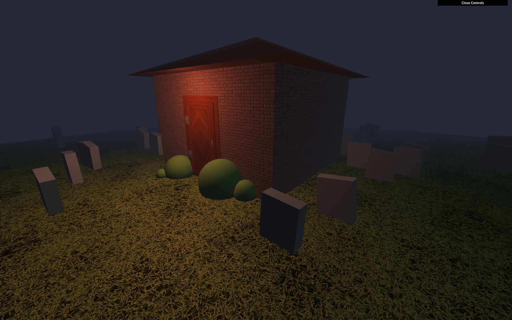

## Ghosts

For the ghosts, let's keep things simple and do with what we know.

We are going to use simple lights floating around the house and passing through the ground and graves.

```js
/**
 * Ghosts
 */
const ghost1 = new THREE.PointLight('#ff00ff', 2, 3)
scene.add(ghost1)

const ghost2 = new THREE.PointLight('#00ffff', 2, 3)
scene.add(ghost2)

const ghost3 = new THREE.PointLight('#ffff00', 2, 3)
scene.add(ghost3)
```

Now we can animate them using some mathematics with a lot of trigonometry:

```js
const clock = new THREE.Clock()

const tick = () =>
{
    const elapsedTime = clock.getElapsedTime()

    // Ghosts
    const ghost1Angle = elapsedTime * 0.5
    ghost1.position.x = Math.cos(ghost1Angle) * 4
    ghost1.position.z = Math.sin(ghost1Angle) * 4
    ghost1.position.y = Math.sin(elapsedTime * 3)

    const ghost2Angle = - elapsedTime * 0.32
    ghost2.position.x = Math.cos(ghost2Angle) * 5
    ghost2.position.z = Math.sin(ghost2Angle) * 5
    ghost2.position.y = Math.sin(elapsedTime * 4) + Math.sin(elapsedTime * 2.5)

    const ghost3Angle = - elapsedTime * 0.18
    ghost3.position.x = Math.cos(ghost3Angle) * (7 + Math.sin(elapsedTime * 0.32))
    ghost3.position.z = Math.sin(ghost3Angle) * (7 + Math.sin(elapsedTime * 0.5))
    ghost3.position.y = Math.sin(elapsedTime * 4) + Math.sin(elapsedTime * 2.5)

    // ...
}
```


_https://threejs-journey.xyz/assets/lessons/16/step-18.mp4_

## Shadows

<p>Finally, to add more realism, let's add shadows.

Activate the shadow map on the renderer:

```js
renderer.shadowMap.enabled = true
```

Activate the shadows on the lights that you think should cast shadows:

```js
moonLight.castShadow = true
doorLight.castShadow = true
ghost1.castShadow = true
ghost2.castShadow = true
ghost3.castShadow = true
```

Go through each object of your scene and decide if that object can cast and/or receive shadows:

```js
walls.castShadow = true
bush1.castShadow = true
bush2.castShadow = true
bush3.castShadow = true
bush4.castShadow = true

for(let i = 0; i < 50; i++)
{
    // ...
    grave.castShadow = true
    // ...
}

floor.receiveShadow = true
```

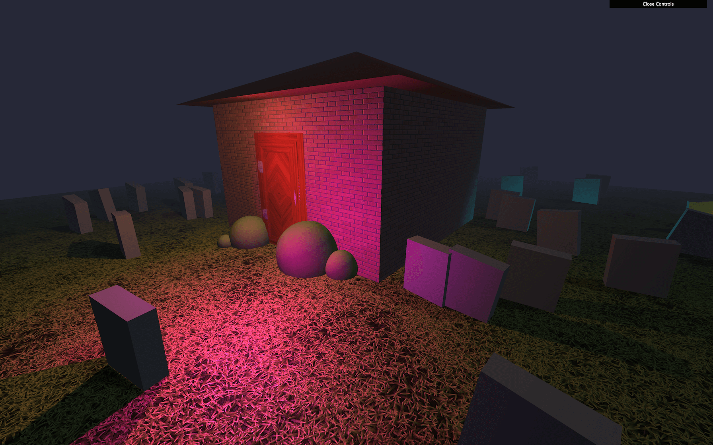

The scene looks much better with these shadows, but we should optimize them anyway.

A good thing would be to go through each light, create camera helpers on the `light.shadowMap.camera`, and make sure the `near`, the `far`, the `amplitude` or the `fov` fit nicely. But instead, let's use the following values that should be just right.

We can also reduce the shadow map render sizes to improve performances:

```js
moonLight.shadow.mapSize.width = 256
moonLight.shadow.mapSize.height = 256
moonLight.shadow.camera.far = 15

// ...

doorLight.shadow.mapSize.width = 256
doorLight.shadow.mapSize.height = 256
doorLight.shadow.camera.far = 7

// ...

ghost1.shadow.mapSize.width = 256
ghost1.shadow.mapSize.height = 256
ghost1.shadow.camera.far = 7

// ...

ghost2.shadow.mapSize.width = 256
ghost2.shadow.mapSize.height = 256
ghost2.shadow.camera.far = 7

// ...

ghost3.shadow.mapSize.width = 256
ghost3.shadow.mapSize.height = 256
ghost3.shadow.camera.far = 7

// ...

renderer.shadowMap.type = THREE.PCFSoftShadowMap
```

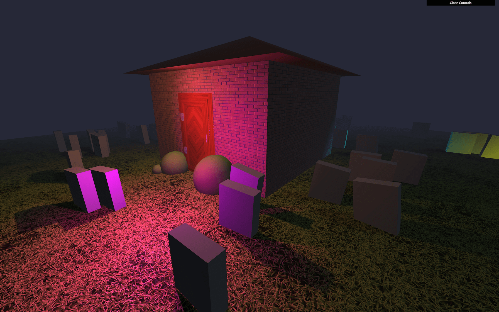

This process is long, but it's essential. We are already flirting with performance limitations, and the haunted house might not even work at 60fps on mobile. We will see more optimization tips in a future lesson.

## Go further

That's it for the lesson, but you can try to improve what we did. You can add new elements in the scene, replace the ghosts with real 3D ghosts by using Three.js primitives, add names on the grave, etc.
