# Realistic render

[](https://shields.io)

Learn in [https://threejs-journey.xyz/lessons/23](https://threejs-journey.xyz/lessons/23)

## Introduction

When we imported our hamburger in the previous lesson, the colors were off. To put it in a nutshell: many things participate in a wrong looking model.

Sometimes, we want a very realistic render. Maybe it's because we want to showcase a real-life product on our website. Or perhaps we are 3D artists, and we want to show off our work with the best possible result. Anyway, we need a render as real as possible.

In this lesson, we will learn many techniques to improve our model looks once rendered in Three.js. Be careful though, some of those techniques can have a performance impact, and some techniques depend on your model. You'll have to adapt according to the situation.

## Setup

We could use our hamburger, but it's better to try a more realistic model with textures, normal maps, etc. We will use the [Flight Helmet](https://github.com/KhronosGroup/glTF-Sample-Models/tree/master/2.0/FlightHelmet) from the [GLTF Sample Models repository](https://github.com/KhronosGroup/glTF-Sample-Models). You can find the model in the `/static/models/` folder.

This lesson is also the perfect opportunity to revise what we already learned. That is why there isn't much code in the starter. We will have to instantiate the loaders, the lights, the shadows, etc., all by ourselves.

We will also use Dat.GUI to tweak as many parameters as possible. That is required if we want to create the perfect environment.

For now, all we have in our scene is a white sphere and an instance of Dat.GUI.


This sphere is just a placeholder to make sure that the starter is working, but we can use it to set up the lights. Change the material of `testSphere` to [MeshStandardMaterial](https://threejs.org/docs/index.html#api/en/materials/MeshStandardMaterial) to see the lights we are about to add:

```js
const testSphere = new THREE.Mesh(
    new THREE.SphereGeometry(1, 32, 32),
    new THREE.MeshStandardMaterial()
)
```

As you can see, everything has gone black.

## Lights

We are going to use only one [DirectionalLight](https://threejs.org/docs/index.html#api/en/lights/DirectionalLight). But how can we have a realistic render with only one light? The environment map will do most of the heavy leverage and simulate light bounce. We could get rid of any light, but the [DirectionalLight](https://threejs.org/docs/index.html#api/en/lights/DirectionalLight) is important if we want to have more control over the lighting but also to create shadows:

```js
const directionalLight = new THREE.DirectionalLight('#ffffff', 1)
directionalLight.position.set(0.25, 3, - 2.25)
scene.add(directionalLight)
```

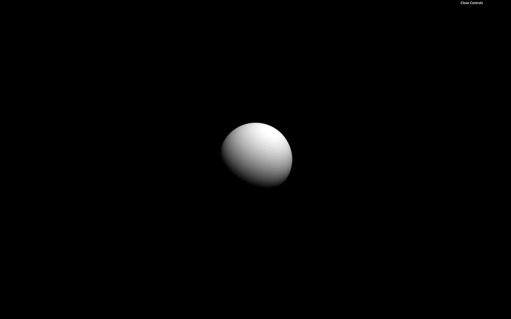

Let's add some parameters to our Dat.GUI:

```js
gui.add(directionalLight, 'intensity').min(0).max(10).step(0.001).name('lightIntensity')
gui.add(directionalLight.position, 'x').min(- 5).max(5).step(0.001).name('lightX')
gui.add(directionalLight.position, 'y').min(- 5).max(5).step(0.001).name('lightY')
gui.add(directionalLight.position, 'z').min(- 5).max(5).step(0.001).name('lightZ')
```

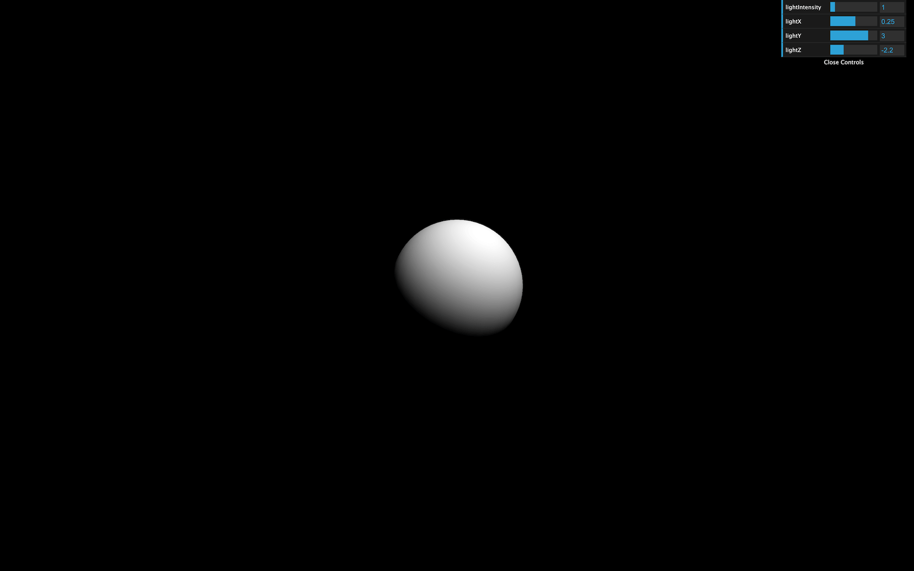

We can now control the `position` and `intensity`.

Default Three.js light intensity values aren't realistic. They are based on an arbitrary scale unit and don't reflect real-world values. You could say it doesn't matter, but it's better to base our scene on realistic and standard values. It might be more comfortable to reproduce real-life conditions that way.

To change Three.js lights for more realistic values, switch the `physicallyCorrectLights` property of the [WebGLRenderer](https://threejs.org/docs/index.html#api/en/renderers/WebGLRenderer) instance (the `renderer`) to `true`:

```js
renderer.physicallyCorrectLights = true
```

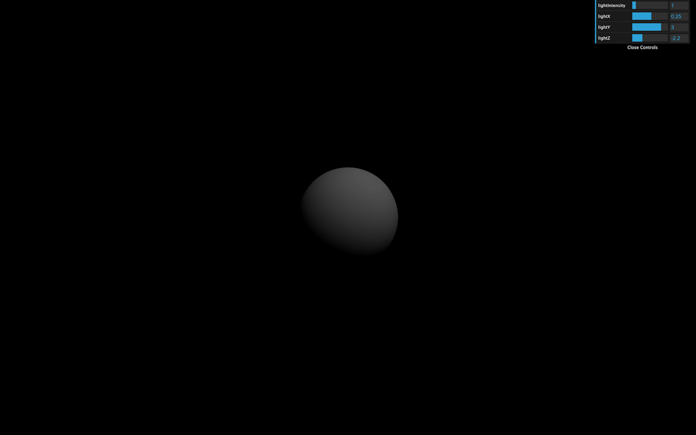

Our light appears dimmed. Let's increase its intensity to `3`:

```js
const directionalLight = new THREE.DirectionalLight('#ffffff', 3)
```

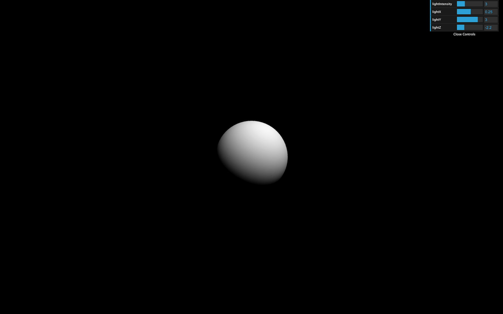

## Model

Let's load our model instead of that test sphere.

First, instantiate the [GLTFLoader](https://threejs.org/docs/index.html#examples/en/loaders/GLTFLoader). We will regroup the different loaders together. There is no particular reason for that but to regroup things together:

```js
import { GLTFLoader } from 'three/examples/jsm/loaders/GLTFLoader.js'

// ...

/**
 * Loaders
 */
const gltfLoader = new GLTFLoader()
```

We don't need the [DRACOLoader](https://threejs.org/docs/index.html#examples/en/loaders/DRACOLoader) because the model isn't compressed. But if you load a Draco compressed model, instantiate the [DRACOLoader](https://threejs.org/docs/index.html#examples/en/loaders/DRACOLoader) as we did in a previous lesson.

We can now load our model located in `/static/models/FlightHelmet/glTF/FlightHelmet.gltf`:

```js
/**
 * Models
 */
gltfLoader.load(
    '/models/FlightHelmet/glTF/FlightHelmet.gltf',
    (gltf) =>
    {
        console.log('success')
        console.log(gltf)
    }
)
```

As always, go slow, make sure that the model is well loaded with no error, and study the imported result.

Because it's a complex model, we will simply add the `gltf.scene` group to our own scene:

```js
gltfLoader.load(
    '/models/FlightHelmet/glTF/FlightHelmet.gltf',
    (gltf) =>
    {
        scene.add(gltf.scene)
    }
)
```


If you can't see it but don't get any error, Remove your `testSphere` and zoom a little. The explanation is simple: the loaded model is too small.

Increase its scale, move it down a little, and rotate it so it fits our camera view better:

```js
gltfLoader.load(
    '/models/FlightHelmet/glTF/FlightHelmet.gltf',
    (gltf) =>
    {
        gltf.scene.scale.set(10, 10, 10)
        gltf.scene.position.set(0, - 4, 0)
        gltf.scene.rotation.y = Math.PI * 0.5
        scene.add(gltf.scene)
    }
)
```

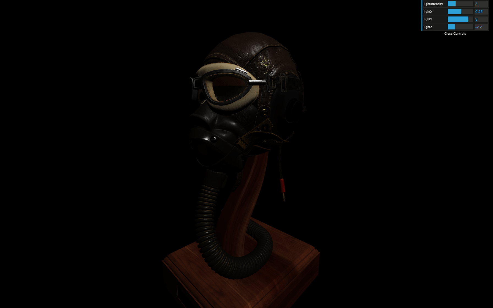

Let's also add a tweak to rotate the whole model in our Dat.GUI:

```js
gltfLoader.load(
    '/models/FlightHelmet/glTF/FlightHelmet.gltf',
    (gltf) =>
    {
        // ...

        gui.add(gltf.scene.rotation, 'y').min(- Math.PI).max(Math.PI).step(0.001).name('rotation')
    }
)
```

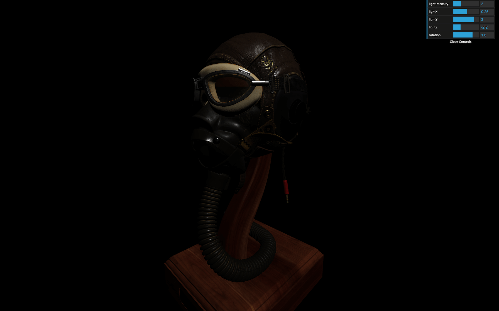

## Environment map

We can't see much of our model because we have only one weak [DirectionalLight](https://threejs.org/docs/index.html#api/en/lights/DirectionalLight). As we said previously, the lighting will be taken care of by the environment map.

We already talked about the environment map in the Materials lesson. An environment map is like a photo of the surrounding. It can be a 360 photo or 6 photos that, once put together, compose a cube.

We will use the environment map both for the background and to illuminate our model.

### Load the environment map

First, let's load our environment map. There are multiple textures located in the `/static/textures/environmentMaps/` folder. We are going to use the first one.

Because these textures are composed of 6 images (a cube), we have to use a [CubeTextureLoader](https://threejs.org/docs/index.html#api/en/loaders/CubeTextureLoader).

Add the [CubeTextureLoader](https://threejs.org/docs/index.html#api/en/loaders/CubeTextureLoader) to our loaders:

```js
const cubeTextureLoader = new THREE.CubeTextureLoader()
```

Now we can load the textures. The order is `positive x`, `negative x`, `positive y`, `negative y`, `positive z`, and `negative z`.

Add it after creating the `scene`:

```js
/**
 * Environment map
 */
const environmentMap = cubeTextureLoader.load([
    '/textures/environmentMaps/0/px.jpg',
    '/textures/environmentMaps/0/nx.jpg',
    '/textures/environmentMaps/0/py.jpg',
    '/textures/environmentMaps/0/ny.jpg',
    '/textures/environmentMaps/0/pz.jpg',
    '/textures/environmentMaps/0/nz.jpg'
])
```

Nothing should have change because we are loading the environment map but we don't use it yet.

Check the logs for potential errors.

### Apply the environment map to the background

To add the environment map in our scene's background, we could create a massive cube around the scene, set its face to be visible on the inside, and apply its texture. It should work and looks ok, but instead, let's use a feature included in Three.js.

To apply an environmentMap on a scene, use the cube texture on the [Scene](https://threejs.org/docs/index.html#api/en/scenes/Scene.background)'s `background` property. Make sure to do this after creating the `environmentMap` and the `scene`:

```js
scene.background = environmentMap
```


And that's all. You should see the environment map in the background.

### Apply the environment map to the model

One essential feature to get a realistic render is to use our environment map to lighten our model.

We have already covered how to apply an environment map to a [MeshStandardMaterial](https://threejs.org/docs/index.html#api/en/materials/MeshStandardMaterial.envMap) with the `envMap` property. The problem is that our model is composed of many [Meshes](https://threejs.org/docs/index.html#api/en/objects/Mesh). What we can do is use the `traverse(...)` method available on every [Object3D](https://threejs.org/docs/index.html#api/en/core/Object3D) —and classes that inherit from it like [Group](https://threejs.org/docs/index.html#api/en/objects/Group) and [Mesh](https://threejs.org/docs/index.html#api/en/objects/Mesh).

Instead of doing it in the success callback function, we will create a `updateAllMaterials` function that will get handy later. Create this function before the environment map:

```js
/**
 * Update all materials
 */
const updateAllMaterials = () =>
{
    scene.traverse((child) =>
    {
        console.log(child)
    })
}
```

Now call it when the model is loaded and added to the scene:

```js
gltfLoader.load(
    '/models/FlightHelmet/glTF/FlightHelmet.gltf',
    (gltf) =>
    {
        // ...

        updateAllMaterials()
    }
)
```

You should see all the children and grand children in the logs.

Instead of logging the children, we want to apply the environment map to each material that should have it.

It would make no sense to apply the environment map to the lights, the camera, the group, etc. We only want to apply the environment map to the [Meshes](https://threejs.org/docs/index.html#api/en/objects/Mesh) that have a [MeshStandardMaterial](https://threejs.org/docs/index.html#api/en/materials/MeshStandardMaterial).

What we can do is test if the `child` is an instance of `THREE.Mesh` and if its material is an instance of `THREE.MeshStandardMaterial`:

```js
const updateAllMaterials = () =>
{
    scene.traverse((child) =>
    {
        if(child instanceof THREE.Mesh && child.material instanceof THREE.MeshStandardMaterial)
        {
            console.log(child)
        }
    })
}
```

We now only log the children that support environment maps. Let's change their `envMap` property in the `material` property:

```js
const updateAllMaterials = () =>
{
    scene.traverse((child) =>
    {
        if(child instanceof THREE.Mesh && child.material instanceof THREE.MeshStandardMaterial)
        {
            child.material.envMap = environmentMap
        }
    })
}
```

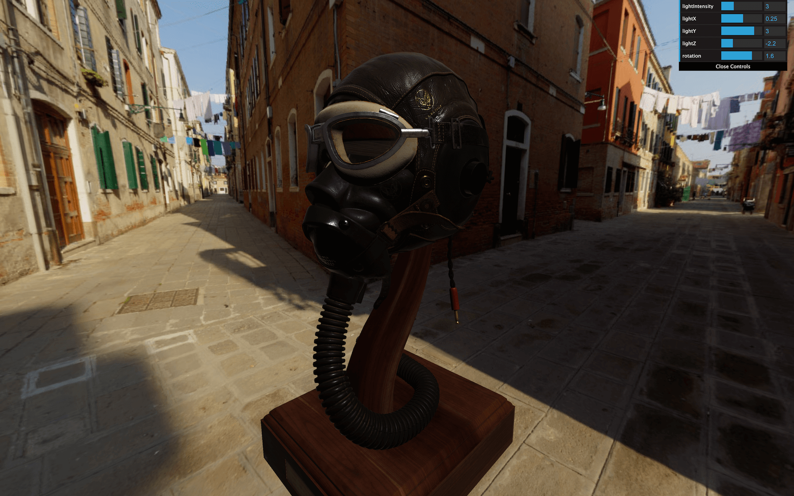

Can't see much of a difference? Increase the `envMapIntensity` to `5`:

```js
const updateAllMaterials = () =>
{
    scene.traverse((child) =>
    {
        if(child instanceof THREE.Mesh && child.material instanceof THREE.MeshStandardMaterial)
        {
            child.material.envMap = environmentMap
            child.material.envMapIntensity = 5
        }
    })
}
```


That's better. We get a nice and realistic lighting.

For more control, let's add the `envMapIntensity` property to our Dat.GUI. The problem is that we need only one property to tweak, and, when changed, this value should be applied to all children materials.

We can, however, use the `debugObject` technique as we did in a previous lesson. Right after instantiating Dat.GUI, create a `debugObject`:

```js
const gui = new dat.GUI()
const debugObject = {}
```

Then, in the environment map code section, add an `envMapIntensity` property to that object as well as to your Dat.GUI:

```js
debugObject.envMapIntensity = 5
gui.add(debugObject, 'envMapIntensity').min(0).max(10).step(0.001) 
```

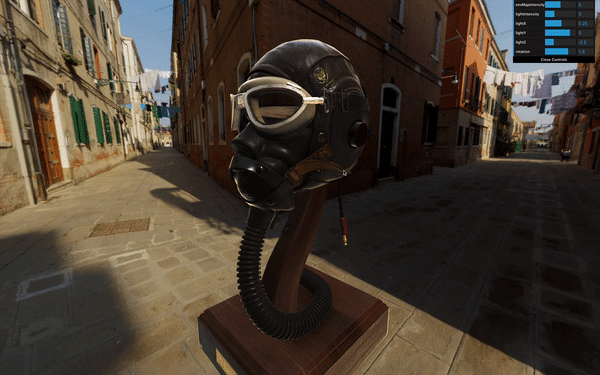

_https://threejs-journey.xyz/assets/lessons/23/step-12.mp4_

We now have the `envMapIntensity` tweak, but changing the value isn't updating the scene and its children. We should now call the `updateAllMaterials` function when the tweak value changes and use the `debugObject.envMapIntensity` value in the `updateAllMaterials` function:

```js
const updateAllMaterials = () =>
{
    // ...
            child.material.envMapIntensity = debugObject.envMapIntensity
    // ...
}

// ...

debugObject.envMapIntensity = 5
gui.add(debugObject, 'envMapIntensity').min(0).max(10).step(0.001).onChange(updateAllMaterials)
```


_https://threejs-journey.xyz/assets/lessons/23/step-13.mp4_

We can now change all [Meshes](https://threejs.org/docs/index.html#api/en/objects/Mesh) environment map intensity with only one tweak directly in our debug interface.

### Apply the environment map as default

There is an easier way of applying the environment map to all objects. We can update the `environment` property of the `scene` just like we changed the `background` property:

```js
scene.environment = environmentMap
```


Unluckily, we cannot change the environment map intensity of each material directly from the scene, so we still need our `updateAllMaterials` function, but it's a perfectly viable solution.

## Renderer

Things are getting more and more realistic, but we still feel that it's all fake. We need to work on the colors, and this is a matter of [WebGLRenderer](https://threejs.org/docs/index.html#api/en/renderers/WebGLRenderer) properties.

### Output encoding

Without going too much into details, the `outputEncoding` property controls the output render encoding. By default, the value of `outputEncoding` is `THREE.LinearEncoding`, which looks ok, but not realistic.

The recommended value for the `outputEncoding` is `THREE.sRGBEncoding`:

```js
renderer.outputEncoding = THREE.sRGBEncoding
```

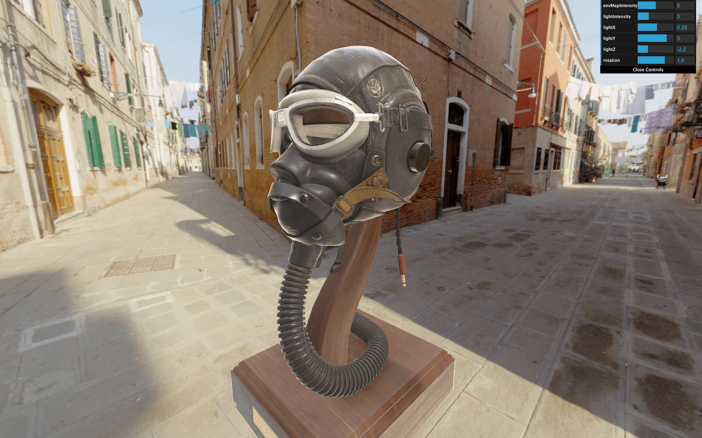

You should see much brighter textures that will also impact the environment map.

Another possible value is `THREE.GammaEncoding`. This encoding has the advantage of letting you play on a value called `gammaFactor` that would act a little like the brightness, but we won't use this one in the lesson.

The Gamma Encoding is a way of storing colors while optimizing how bright and dark values are stored according to human eye sensitivity. When we use the `sRGBEncoding`, it's like using the `GammaEncoding` with a default gamma factor of `2.2`, which is the common value.

You can find out more about this topic here

- [https://www.donmccurdy.com/2020/06/17/color-management-in-threejs/](https://www.donmccurdy.com/2020/06/17/color-management-in-threejs/)
- [https://medium.com/game-dev-daily/the-srgb-learning-curve-773b7f68cf7a](https://medium.com/game-dev-daily/the-srgb-learning-curve-773b7f68cf7a)

While some might think that `GammaEncoding` is better than `sRGBEncoding` because we can control the gamma factor for a darker or brighter scene, this physically doesn't seem right, and we will see how to manage the "brightness" in a better way later.

### Textures encoding

You might not have noticed it, but the environment map colors are wrong. They appear grayish and toned down. Even if the effect looks pretty good, it's more satisfying to preserve the right colors.

The problem is that our renderer `outputEncoding` is `THREE.sRGBEncoding`, yet the environment map texture is by default `THREE.LinearEncoding`.

The rule is straightforward. All textures that we can see directly —like the `map` —should have `THREE.sRGBEncoding` as encoding, and all other textures — such as `normalMap` —should have `THREE.LinearEncoding`.

We can see the `environmentMap` texture directly, so we have to change its encoding to `THREE.sRGBEncoding`:

```js
environmentMap.encoding = THREE.sRGBEncoding
```

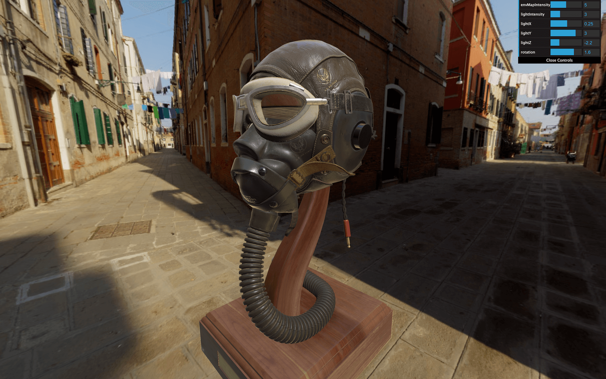

But what about the model textures?

Fortunately, the [GLTFLoader](https://threejs.org/docs/#examples/en/loaders/GLTFLoader) implemented this rule, and all the textures loaded from it will have the right `encoding` automatically.

### Tone mapping

The tone mapping intends to convert High Dynamic Range (HDR) values to Low Dynamic Range (LDR) values. HDR is much more than the following interpretation, but you can see that like images where the color values can go beyond `1`. It's useful if we want to store light information because light doesn't have intensity limits.

While our assets are not HDR, the tone mapping effect can have a realistic result as if the camera was poorly adjusted.

To change the tone mapping, update the `toneMapping` property on the [WebGLRenderer](https://threejs.org/docs/index.html#api/en/renderers/WebGLRenderer).

There are multiple possible values:

- `THREE.NoToneMapping` (default)
- `THREE.LinearToneMapping`
- `THREE.ReinhardToneMapping`
- `THREE.CineonToneMapping`
- `THREE.ACESFilmicToneMapping`

Test these tone mapping:

```js
renderer.toneMapping = THREE.ACESFilmicToneMapping
```


To appreciate the difference, let's add the `toneMapping` to our Dat.GUI. We can create a dropdown tweak by sending an object with different keys and values as the third parameter of `gui.add(...)`:

```js
gui.add(renderer, 'toneMapping', {
    No: THREE.NoToneMapping,
    Linear: THREE.LinearToneMapping,
    Reinhard: THREE.ReinhardToneMapping,
    Cineon: THREE.CineonToneMapping,
    ACESFilmic: THREE.ACESFilmicToneMapping
})
```

Unfortunately, changing this tweak will result in a warning in the console, looking like`THREE.WebGLProgram: Unsupported toneMapping: 3`. The problem is a bug with Dat.GUI interpreting the values of the object as a String.

For example, if we use `THREE.ReinhardToneMapping`, the value behind this constant is `3` as a `Number`. But once we change the tweak for tone mapping, Dat.GUI will send `'3'` as a `String` which will result in the error previously mentioned.

We can fix that by converting the value to a `Number` in the change event callback:

```js
gui
    .add(renderer, 'toneMapping', {
        No: THREE.NoToneMapping,
        Linear: THREE.LinearToneMapping,
        Reinhard: THREE.ReinhardToneMapping,
        Cineon: THREE.CineonToneMapping,
        ACESFilmic: THREE.ACESFilmicToneMapping
    })
    .onFinishChange(() =>
    {
        renderer.toneMapping = Number(renderer.toneMapping)
    })
```

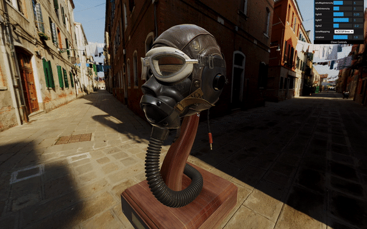

_https://threejs-journey.xyz/assets/lessons/23/step-18.mp4_

Changing the tone mapping should work. Nevertheless, if you watch closely, you'll see that the tone mapping changed for the environment map in the background, but not for the model itself.

We need to find a way to tell the materials that they need to be updated and we already did that in the `updateAllMaterials` function. What we can do is call this function right after changing the `toneMapping`:

```js
    .onFinishChange(() =>
    {
        renderer.toneMapping = Number(renderer.toneMapping)
        updateAllMaterials()
    })
```


_https://threejs-journey.xyz/assets/lessons/23/step-19.mp4_

The materials should also update when changing the tone mapping.

We can also change the tone mapping exposure. You can see that like how much light we let in and the algorithm will handle it its way. To change this value, we must update the `toneMappingExposure` property directly on the `renderer`:

```js
renderer.toneMappingExposure = 3
```

Let's add it to Dat.GUI as well:

```js
gui.add(renderer, 'toneMappingExposure').min(0).max(10).step(0.001)
```


_https://threejs-journey.xyz/assets/lessons/23/step-20.mp4_

Feel free to choose your favorite `toneMapping` for the rest of the lesson, but here we will go for `THREE.ReinhardToneMapping`.

### Antialiasing

We call aliasing an artifact that might appear in some situations where we can see a stair-like effect, usually on the edge of geometries.

Our model isn't subject to that problem because there is a lot of details, but if you have a screen with a pixel ratio of `1`. Look at the edges —especially the bright ones— rotate the camera slowly, and you might see the problem:


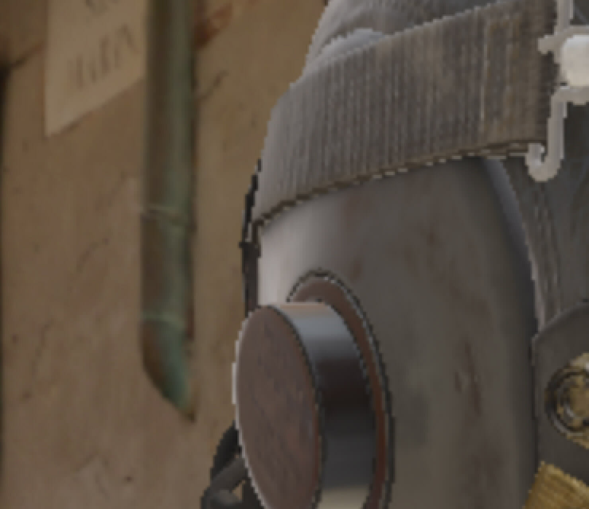

It's a well-known problem. When the rendering of a pixel occurs, it tests what geometry is being rendered in that pixel. It calculates the color, and, in the end, that color appears on the screen.

But geometry edges are usually not perfectly aligned with vertical lines and horizontal lines of pixel of your screen and this is why you get this stair-like artifact named **aliasing**.

There are many ways of fixing that problem, and developers have been struggling with it for many years.

One easy solution would be to increase our render's resolution, let's say to the double. When resized to it's normal-sized, each pixel color will automatically be averaged from the 4 pixels rendered.

This solution is called **super sampling** (SSAA) or **fullscreen sampling** (FSAA), and it's the easiest and more efficient one. Unfortunately, that means 4 times more pixels to render, which can result in performance issues.

The other solution is called **multi sampling** (MSAA). Again, the idea is to render multiple values per pixel (usually 4) like for the **super sampling** but only on the geometries' edges. The values of the pixel are then averaged to get the final pixel value.

The most recent GPU can perform this **multi sampling** anti-aliasing, and Three.js handles the setup automatically. We just need to change the `antialias` property to `true` during the instantiating — and not after:

```js
const renderer = new THREE.WebGLRenderer({
    canvas: canvas,
    antialias: true
})
```

Those aliasing artifacts should be gone now.

Using the antialias exhausts some resources. As we said earlier, screens with a pixel ratio above `1` don't really need antialias. One right way to do this would be to activate it only for screens with a pixel ratio below `2`. We will see how to achieve that in a future lesson, along with other optimizations.

## Shadows

The final touch for a realistic render is to add shadows. First, toggle the shadows on [WebGLRenderer](https://threejs.org/docs/index.html#api/en/renderers/WebGLRenderer). Then, change the shadow type to `THREE.PCFSoftShadowMap` as we did in the Shadows lesson:

```js
renderer.shadowMap.enabled = true
renderer.shadowMap.type = THREE.PCFSoftShadowMap
```

Activate it on the [DirectionalLight](https://threejs.org/docs/index.html#api/en/lights/DirectionalLight):

```js
directionalLight.castShadow = true
```

We also need to set the camera that handles the shadow for this light.

Add a [CameraHelper](https://threejs.org/docs/index.html#api/en/helpers/CameraHelper) to the `directionalLight.shadow.camera`:

```js
const directionalLightCameraHelper = new THREE.CameraHelper(directionalLight.shadow.camera)
scene.add(directionalLightCameraHelper)
```

We can now see accurately what the shadow camera will render. The box should already fit pretty nicely with the scene. Let's reduce the `far` value:

```js
directionalLight.shadow.camera.far = 15
```

We can remove or comment the `directionalLightCameraHelper`.

As we want realistic and precise shadows and because we have only one light, we can increase the shadow map size to `1024x1024` without fearing a frame rate drop.

```js
directionalLight.shadow.mapSize.set(1024, 1024)
```

Finally, we can activate the shadows on all the [Meshes](https://threejs.org/docs/index.html#api/en/objects/Mesh) of our model. As we are already traversing the scene in the `updateAllMaterials` function, let's simply activate both `castShadow` and `receiveShadow` on all the children:

```js
const updateAllMaterials = () =>
{
    scene.traverse((child) =>
    {
        if(child instanceof THREE.Mesh && child.material instanceof THREE.MeshStandardMaterial)
        {
            // ...

            child.castShadow = true
            child.receiveShadow = true
        }
    })
}
```

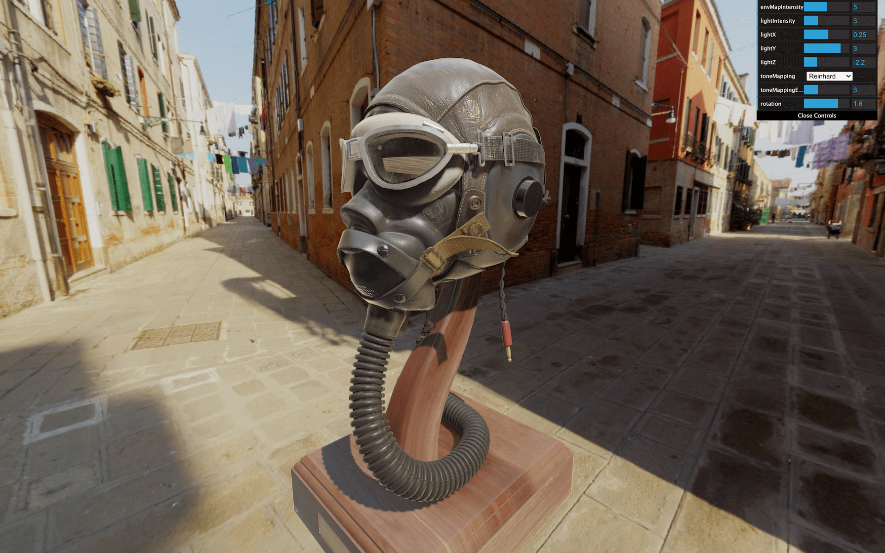

You should now observe an accurate shadow, mostly on the wood base and inside the model.

## Final tweaks

Now that we have everything in place, we can tweak the values, make sure the `directionalLight` corresponds to the light in the environment map, try other environment maps, test different tone mappings, add animation, etc.

It's up to you. Take your time, stop looking at your render, and look around because you need real-life markers, make sure your screen colors are good, maybe show your work to your friends to get an external point of view until everything is correctly set.

## Hamburger

Let's try with our hamburger. A version is already located in `/static/models/hamburger.glb`.

This file isn't Draco compressed. If you are using your model, make sure it's not compressed or add the [DRACOLoader](https://threejs.org/docs/index.html#examples/en/loaders/DRACOLoader) to the [GLTFLoader](https://threejs.org/docs/index.html#examples/en/loaders/GLTFLoader) as we did in the **Imported Model** lesson.

Replace the path to load the hamburger and change the scale and position:

```js
gltfLoader.load(
    '/models/hamburger.glb',
    (gltf) =>
    {
        gltf.scene.scale.set(0.3, 0.3, 0.3)
        gltf.scene.position.set(0, - 1, 0)
        scene.add(gltf.scene)

        updateAllMaterials()
    }
)
```


Your hamburger appears, but some nasty strips cover its surface.


No we didn't let the hamburger burn on the grill.

These artifacts are called shadow acne. Shadow acne can occur on both smooth and flat surfaces for precision reasons when calculating if the surface is in the shadow or not. What's happening here is that the hamburger is casting a shadow on its own surface.

We have to tweak the light `shadow`'s `bias` and `normalBias` properties to fix this shadow acne.

The `bias` usually helps for flat surfaces. It's not our case here, but if you have the problem on flat surfaces, try to increase the `bias` slightly until the acne disappears.

The `normalBias` usually helps for rounded surfaces, which is our case. Let's increase it until the shadow acne is barely visible:

```js
directionalLight.shadow.normalBias = 0.05
```

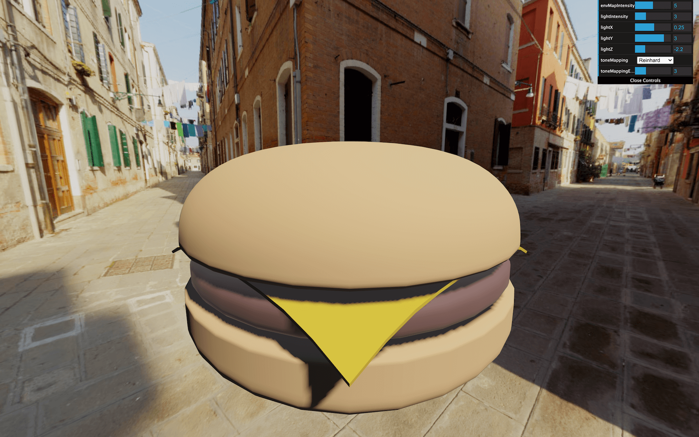

Now you get a very decent, acne-free hamburger.

Bon appétit.
